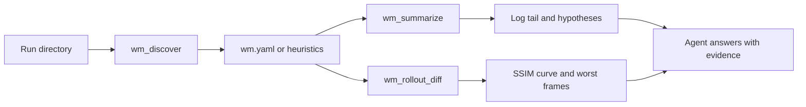

# DSH-WM

[](LICENSE)
[](cordis.patch.yml)
[](package.json)

**A world-model research assistant for DeepSeek Harness: discover a run, summarize the log, and diff pred vs GT — one bundle and three skills.**

Point the agent at a run directory and ask what happened, where the rollout drifts, and what to ablate next.

🌐 **English** | [中文](README.zh.md)

If you train or evaluate world models (video / action-conditioned generation, memory, revisit), you may have run into the same problems: the agent greps a 2 GB log, compares two runs that do not share a seed, or captions a last frame and calls it loop closure.

This package is a DeepSeek Harness **profile bundle**, not a fork. It does not replace [dsh-vision-toolkit](https://github.com/Anionex/dsh-vision-toolkit) (image understanding). It scores and triages **runs**.

```sh
dsh plugin --profile wm add github:WayneJin0918/dsh-wm
dsh --profile wm
```

## Highlights

- **One command to install.** Official bundle format, pure JavaScript, no `prepare` / `allowBuilds`.
- **A run is a directory, not a vibe.** Optional `wm.yaml` declares pred / gt / log / metrics. No manifest → heuristics. Cannot tell → candidates and warnings, never invented paths.
- **Three tools, one loop.** `wm_discover` → `wm_summarize` → `wm_rollout_diff`.
- **Skills that keep the agent honest.** Triage, fair ablation, and revisit checks are installed into the Harness skill catalog.
- **Works without Harness.** The same tools run as `node cli.js` for CI and offline demos.
- **No GPU on day one.** Luminance SSIM + MSE in pure JS. Videos need `ffmpeg`; PNG/PPM frame folders do not.

## Who it is for

| The problem | What DSH-WM delivers |
| --- | --- |
| **The agent cannot see what a run contains** | `wm_discover` returns layout, paths, frame counts, and warnings |
| **A log tail is not a conclusion** | `wm_summarize` reports last step / loss / NaN / early-stop plus three testable hypotheses |
| **“Looks worse” is not a metric** | `wm_rollout_diff` returns mean/min SSIM, a curve, worst frames, and a one-line diagnosis |
| **Ablations mix scenes and seeds** | `wm-ablation` requires paired `(scene, protocol, seed)` and failure rate before any mean |
| **First-vs-last SSIM is sold as loop closure** | `wm-revisit` labels that number a frame-similarity proxy, not geometric revisit |

## Quick start: three steps

### 1. Install

Into a dedicated research profile:

```sh
dsh plugin --profile wm add github:WayneJin0918/dsh-wm
```

Web or Headless also work:

```sh
dsh plugin --profile web add github:WayneJin0918/dsh-wm
dsh plugin --profile headless add github:WayneJin0918/dsh-wm
```

From a local checkout (this repository is private; a path install does not need GitHub access):

```sh
dsh plugin --profile wm add /path/to/dsh-wm
```

The package is pure JS. Git installs do not need pnpm `allowBuilds`. Pin a commit if you do not want a moving default branch: `github:WayneJin0918/dsh-wm#<sha>`.

### 2. Restart and check it

```sh
dsh --profile wm --dump-config    # look for "# == dsh-wm"
dsh --profile wm
```

Restart a running Web profile after adding the bundle, then start a new session so the skill catalog reloads.

Without Harness:

```sh
node cli.js discover fixtures/sunset
node cli.js summarize fixtures/sunset
node cli.js diff --pred fixtures/sunset/pred --gt fixtures/sunset/gt
```

### 3. Point at a run and say what you want

Put a `wm.yaml` in the run root (or rely on heuristics), then ask:

```text
Triage fixtures/sunset. What failed, and is it late-horizon?
Diff pred vs GT and name the worst frames.
These two runs claim a memory win — are they paired on scene/protocol/seed?
```

## Common workflows

| Task | Recommended workflow |
| --- | --- |
| A training or eval run looks wrong | `wm-run-triage` → discover → summarize → diff |
| Which cache / memory config won? | `wm-ablation` → paired n and failure rate → mean delta |
| Did the camera come back? | `wm-revisit` → full-strip diff → first/last only if no poses |
| Offline CI / no API key | `node cli.js` on the same paths |

## Toolbox

| Tool | Best question to ask | Main result |
| --- | --- | --- |
| `wm_discover` | “What is in this run directory?” | layout, pred/gt/log/metrics, frame counts, warnings |
| `wm_summarize` | “Did training actually finish, and what should I test?” | last loss / NaN / early-stop, metric keys, 3 hypotheses |
| `wm_rollout_diff` | “Where does pred drift from GT?” | mean/min SSIM, curve, worst 3 frames, diagnosis |

Day-1 metrics are **luminance SSIM + MSE**. There is no LPIPS / RAFT yet; a later `--backend lpips` can wrap a local Python env.

## `wm.yaml`

```yaml
name: sunset-revisit
pred: outputs/pred          # frame directory or mp4
gt: outputs/gt
log: logs/train.log
metrics: metrics.json       # any JSON; keys are summarized, not schema-validated
```

Without the file, the plugin looks for `pred|preds|recon`, `gt|target|ref`, `train.log` / `logs/*.log`, and `metrics.json` / `*eval*.json`.

## How it works



This project has two layers:

1. **Tools** that only read the filesystem (no GPU, no training submit).
2. **Skills** that tell the model when those tools are allowed to support a claim.

[dsh-vision-toolkit](https://github.com/Anionex/dsh-vision-toolkit) is the complementary “eyes” plugin. Install both if the agent must look at a screenshot *and* score a rollout.

## Offline fixture

`fixtures/sunset` is an 8-frame synthetic strip. Pred frames 0–3 stay close to GT; 4–7 are wiped so second-half SSIM drops. No checkpoint, cluster, or GPU.

```sh
npm test
npm run check
node scripts/generate-fixtures.js    # regenerate after changing the painter
```

## Configuration and limits

### Requirements

- DeepSeek Harness `0.1.0-rc.6` or compatible, with `pnpm` on PATH for `dsh plugin`.
- Node.js 18+.
- Optional `ffmpeg` for JPEG or video inputs. PNG/PPM frame directories work offline.

### Install, upgrade, disable, and uninstall

```sh
dsh plugin --profile wm update github:WayneJin0918/dsh-wm
dsh plugin --profile wm remove dsh-wm
```

To disable the bundle temporarily, set this in the profile patch:

```yaml
- id: dsh-wm
  disabled: true
```

Restart the profile after enabling or upgrading.

### Not in 0.1.0

Forking Harness, a custom video timeline UI, W&B / slurm submit, DreamX / Omni-world / OpenWAM adapters, LPIPS, optical flow, and RSI / evolver. Those belong in later plugins that call this layout contract.

## Troubleshooting

| Problem | What to do |
| --- | --- |
| `--dump-config` has no `# == dsh-wm` layer | Re-run `dsh plugin --profile wm add` from the checkout or `github:WayneJin0918/dsh-wm`; confirm `pnpm` is on PATH |
| Git install fails on a private repo | Use a local path, or a machine whose `gh` / git credentials can read `WayneJin0918/dsh-wm` |
| `pred not found` | Add a `wm.yaml` or pass explicit `--pred` / `--gt` to `wm_rollout_diff` |
| Video / JPEG rejected | Install `ffmpeg`, or extract PNG frames first |
| Agent concludes without tools | Load `wm-run-triage` before asking; the skill forbids a layout-free verdict |
| First-last SSIM treated as loop closure | Load `wm-revisit`; without poses that number is a proxy only |

## Development

```sh
npm test
npm run check
```

- See [CHANGELOG.md](CHANGELOG.md) for releases.
- Use GitHub Issues on this private repository for bugs and focused requests.

## License

[MIT](LICENSE)
