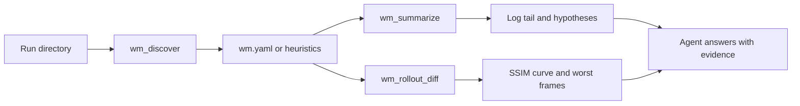
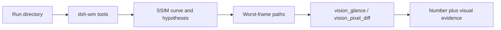

# DSH-WM

[](LICENSE)
[](cordis.patch.yml)
[](package.json)

**A world-model research toolkit for DeepSeek Harness: measure runs, look up built-in WM technique knowledge, and run an RSI loop on the research process — not a three-command scorecard.**

Ask why a return trip forgot the room, whether sparse memory is allowed to beat FIFO, or how Creator mode should iterate a skill — and get a card, a measurement, and a rollback, not a new U-Net from chat.

🚀 Install with one command | Built-in WM knowledge | RSI on skills and evals | Compose with Vision Toolkit when you need eyes

🌐 **English** | [中文](README.zh.md)

If you train or evaluate world models (video / action-conditioned generation, memory, revisit) inside DeepSeek Harness, you may have run into the same problems: the model cannot see a rollout strip, a generic caption misses the failure mode, two runs are compared without a shared seed, and “looks close” has no number.

This package is a DeepSeek Harness **profile bundle**, not a fork. It is closer to [DSH Vision Toolkit](https://github.com/Anionex/dsh-vision-toolkit) in *scope* (knowledge + skills + composable tools) than to a one-off eval script. Scoring a run is one workflow. The rest is: built-in technique cards, symptom → next-step diagnosis, and RSI that uses Harness trajectories / Creator / fixtures to improve the **research loop**. When a frame must be *seen*, reuse the toolkit’s vision modules ([homepage](https://agent-vision.anionex.me)).

```sh
dsh plugin --profile wm add github:WayneJin0918/dsh-wm
dsh --profile wm
```

## Highlights

- **One command to install.** Official bundle format, pure JavaScript, no `prepare` / `allowBuilds`.
- **A run is a directory, not a vibe.** Optional `wm.yaml` declares pred / gt / log / metrics. No manifest → heuristics. Cannot tell → candidates and warnings, never invented paths.
- **Measure when you have a run.** `wm_discover` → `wm_summarize` → `wm_rollout_diff` is the numeric loop, not the whole product.
- **Built-in WM knowledge.** Cards for chunk-AR, memory types, KV memory, exposure bias, revisit vs proxy, ablation, action following, cache eviction, and RSI-in-Harness. `wm_knowledge` / `wm_diagnose` before a new architecture.
- **RSI on the harness layer.** Skill `wm-rsi` uses DSH trajectory, fork, Creator, and `fixtures/sunset` to evolve skills, `wm.yaml`, and eval recipes — not to silently rewrite the backbone.
- **Skills that keep the agent honest.** Triage, knowledge, RSI, fair ablation, revisit.
- **Works without Harness.** The same tools run as `node cli.js` for CI and offline demos.
- **No GPU on day one.** Luminance SSIM + MSE in pure JS. Videos need `ffmpeg`; PNG/PPM frame folders do not.
- **Compose with Vision Toolkit.** Keep numeric rollout scores here; hand worst frames to `vision_glance` / `vision_pixel_diff` / `vision_crop` when a text model needs eyes. Do not reimplement those tools.

## Who it is for

| The problem | What DSH-WM delivers |
| --- | --- |
| **The agent cannot see what a run contains** | `wm_discover` returns layout, paths, frame counts, and warnings |
| **A log tail is not a conclusion** | `wm_summarize` reports last step / loss / NaN / early-stop plus three testable hypotheses |
| **“Looks worse” is not a metric** | `wm_rollout_diff` returns mean/min SSIM, a curve, worst frames, and a one-line diagnosis |
| **Ablations mix scenes and seeds** | `wm-ablation` requires paired `(scene, protocol, seed)` and failure rate before any mean |
| **First-vs-last SSIM is sold as loop closure** | `wm-revisit` labels that number a frame-similarity proxy, not geometric revisit |
| **The agent invents a KV design from a caption** | `wm_knowledge` / `wm_diagnose` open `kv-memory` and `chunk-ar`; no card, no architecture |
| **We want the harness to improve how we debug WM** | `wm-rsi`: one claim, one card, one measurement, one skill/`wm.yaml` delta, sunset + paired gate |
| **Need eyes on the worst window** | Same profile + Vision Toolkit `vision_glance` / `vision_pixel_diff` |

## Quick start: three steps

### 1. Install

Into a dedicated research profile:

```sh
dsh plugin --profile wm add github:WayneJin0918/dsh-wm
```

Web or Headless also work:

```sh
dsh plugin --profile web add github:WayneJin0918/dsh-wm
dsh plugin --profile headless add github:WayneJin0918/dsh-wm
```

From a local checkout (this repository is private; a path install does not need GitHub access):

```sh
dsh plugin --profile wm add /path/to/dsh-wm
```

The package is pure JS. Git installs do not need pnpm `allowBuilds`. Pin a commit if you do not want a moving default branch: `github:WayneJin0918/dsh-wm#<sha>`.

### 2. Restart and check it

```sh
dsh --profile wm --dump-config    # look for "# == dsh-wm"
dsh --profile wm
```

Restart a running Web profile after adding the bundle, then start a new session so the skill catalog reloads.

Without Harness:

```sh
node cli.js discover fixtures/sunset
node cli.js summarize fixtures/sunset
node cli.js diff --pred fixtures/sunset/pred --gt fixtures/sunset/gt
```

### 3. Point at a run and say what you want

Put a `wm.yaml` in the run root (or rely on heuristics), then ask:

```text
Triage fixtures/sunset. What failed, and is it late-horizon?
The return trip forgot the room — which memory recipe is even allowed?
Use Harness RSI to tighten the revisit skill; keep sunset as a regression gate.
These two runs claim a memory win — are they paired on scene/protocol/seed?
```

## Common workflows

| Task | Recommended workflow |
| --- | --- |
| A training or eval run looks wrong | `wm-run-triage` → discover → summarize → diff |
| “What kind of memory should we use?” | `wm-knowledge` → `chunk-ar` / `memory-types` / `kv-memory` → then measure |
| Late-horizon melt, train loss fine | `wm_diagnose` → `exposure-bias` → scheduled sampling, not a new U-Net |
| Which cache / memory config won? | `wm-ablation` → paired n and failure rate → mean delta |
| Did the camera come back? | `wm-revisit` → full-strip diff → first/last only if no poses |
| Improve the *research loop* itself | `wm-rsi` → Creator / trajectory → one skill or `wm.yaml` change → sunset gate |
| Offline CI / no API key | `node cli.js knowledge`, `diagnose`, `discover`, `diff` |

## Toolbox

| Tool | Best question to ask | Main result |
| --- | --- | --- |
| `wm_discover` | “What is in this run directory?” | layout, pred/gt/log/metrics, frame counts, warnings |
| `wm_summarize` | “Did training actually finish, and what should I test?” | last loss / NaN / early-stop, metric keys, 3 hypotheses |
| `wm_rollout_diff` | “Where does pred drift from GT?” | mean/min SSIM, curve, worst 3 frames, diagnosis |
| `wm_knowledge` | “What is chunk-AR / KV memory / RSI in Harness?” | catalog or a full technique card |
| `wm_diagnose` | “It forgets when we come back — now what?” | card ids + next tool / skill |

Day-1 metrics are **luminance SSIM + MSE**. There is no LPIPS / RAFT yet; a later `--backend lpips` can wrap a local Python env.

### Knowledge cards

`chunk-ar` · `memory-types` · `kv-memory` · `exposure-bias` · `revisit-eval` · `ablation-protocol` · `action-following` · `cache-eviction` · `rsi-harness` · `diagnosis-map`

```sh
node cli.js knowledge
node cli.js knowledge kv memory
node cli.js knowledge --id rsi-harness
node cli.js diagnose "late collapse after the first chunk"
```

### Skills

- **wm-run-triage** — measure a run; optional Vision Toolkit on worst frames
- **wm-knowledge** — open a card before designing
- **wm-rsi** — Harness trajectory / Creator / fixture gate on the research loop
- **wm-ablation** — paired scene/protocol/seed
- **wm-revisit** — geometric vs proxy

## RSI with Harness

DeepSeek Harness already gives you append-only trajectories, fork/replay, and Creator mode (inspect the live plugin tree). DSH-WM points that at world-model *process*:

1. Write a falsifiable claim.
2. Open `wm_knowledge` (`rsi-harness` + the technique).
3. Measure (`wm_summarize` / `wm_rollout_diff`).
4. Change **one** skill, `wm.yaml` field, or eval note — not the U-Net.
5. Gate on `fixtures/sunset` (must still report late-horizon drop) and a paired user scene.
6. Solidify or roll back; keep the session.

That is the same grain Vision Toolkit uses for visual work: local deterministic tools + a skill that knows when to call them. Here the deterministic core is numbers + cards; the skill forbids unsupervised architecture RSI.

## `wm.yaml`

```yaml
name: sunset-revisit
pred: outputs/pred          # frame directory or mp4
gt: outputs/gt
log: logs/train.log
metrics: metrics.json       # any JSON; keys are summarized, not schema-validated
```

Without the file, the plugin looks for `pred|preds|recon`, `gt|target|ref`, `train.log` / `logs/*.log`, and `metrics.json` / `*eval*.json`.

## How it works



This project has two layers:

1. **Tools** that only read the filesystem (no GPU, no training submit).
2. **Skills** that tell the model when those tools are allowed to support a claim.

## Compose with Vision Toolkit

DSH-WM does not ship a vision model. For image Q&A, grounding, crop, and pixel heatmaps, use the modules already published by [DSH Vision Toolkit](https://github.com/Anionex/dsh-vision-toolkit) ([homepage](https://agent-vision.anionex.me)):

```sh
dsh plugin --profile wm add @anionex/dsh-vision-toolkit
dsh plugin --profile wm add github:WayneJin0918/dsh-wm
```

| After DSH-WM finds… | Ask Vision Toolkit… |
| --- | --- |
| Worst frames from `wm_rollout_diff` | `vision_glance` — what actually broke in this window? |
| A late-horizon drop | `vision_pixel_diff` — heatmap and ranked regions vs GT |
| A single flash frame | `vision_crop` — isolate the bad region for the next note |
| A UI / overlay in the eval viewer | `vision_ground` — original-pixel box, then crop |

The toolkit’s homepage line still holds: paste or point at an image, get task-relevant evidence instead of a generic caption. DSH-WM only decides *which* frames are worth that call.



## Offline fixture

`fixtures/sunset` is an 8-frame synthetic strip. Pred frames 0–3 stay close to GT; 4–7 are wiped so second-half SSIM drops. No checkpoint, cluster, or GPU.

```sh
npm test
npm run check
node scripts/generate-fixtures.js    # regenerate after changing the painter
```

## Configuration and limits

### Requirements

- DeepSeek Harness `0.1.0-rc.6` or compatible, with `pnpm` on PATH for `dsh plugin`.
- Node.js 18+.
- Optional `ffmpeg` for JPEG or video inputs. PNG/PPM frame directories work offline.

### Install, upgrade, disable, and uninstall

```sh
dsh plugin --profile wm update github:WayneJin0918/dsh-wm
dsh plugin --profile wm remove dsh-wm
```

To disable the bundle temporarily, set this in the profile patch:

```yaml
- id: dsh-wm
  disabled: true
```

Restart the profile after enabling or upgrading.

### Not in 0.1.0

Forking Harness, a custom video timeline UI, W&B / slurm submit, DreamX / Omni-world / OpenWAM adapters, LPIPS, optical flow, and RSI / evolver. Those belong in later plugins that call this layout contract.

## Troubleshooting

| Problem | What to do |
| --- | --- |
| `--dump-config` has no `# == dsh-wm` layer | Re-run `dsh plugin --profile wm add` from the checkout or `github:WayneJin0918/dsh-wm`; confirm `pnpm` is on PATH |
| Git install fails on a private repo | Use a local path, or a machine whose `gh` / git credentials can read `WayneJin0918/dsh-wm` |
| `pred not found` | Add a `wm.yaml` or pass explicit `--pred` / `--gt` to `wm_rollout_diff` |
| Video / JPEG rejected | Install `ffmpeg`, or extract PNG frames first |
| Agent concludes without tools | Load `wm-run-triage` before asking; the skill forbids a layout-free verdict |
| First-last SSIM treated as loop closure | Load `wm-revisit`; without poses that number is a proxy only |

## Development

```sh
npm test
npm run check
```

- See [CHANGELOG.md](CHANGELOG.md) for releases.
- Use GitHub Issues on this private repository for bugs and focused requests.

## Acknowledgements

DSH-WM stands on two upstream projects. Thank you to their authors and the plugin format they made reusable.

- **[DeepSeek Harness](https://github.com/deepseek-ai/deepseek-harness)** (`dsh`) — the official runtime this bundle installs into. Models, tools, skills, sessions, and the agent loop are plugins; we add a research profile layer instead of forking the tree. Docs: [deepseek.com/harness](https://deepseek.com/harness/en/).
- **[DSH Vision Toolkit](https://github.com/Anionex/dsh-vision-toolkit)** by [Anionex](https://anionex.me/), with upstream [agent-vision-toolkit](https://github.com/Anionex/agent-vision-toolkit) — the vision modules we compose with, and the publishing layout (bilingual README, three-step install, toolbox table) this page follows. Project site: [agent-vision.anionex.me](https://agent-vision.anionex.me).

World-model scoring stays in this repository. Seeing a frame stays in theirs.

## License

[MIT](LICENSE)
