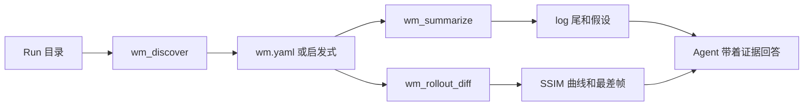
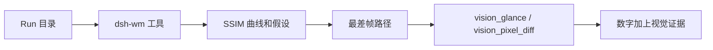

# DSH-WM

[](LICENSE)
[](cordis.patch.yml)
[](package.json)

**给世界模型研究者用的 DeepSeek Harness 工具箱：测量 run、内置 WM 技术知识、用 Harness 做研究过程上的 RSI——不是三个评测命令。**

问回程为什么忘了房间、sparse memory 有没有资格赢 FIFO、Creator 该怎么迭代一个 skill——拿到的是卡片、测量和回滚，不是聊天里长出来的新 U-Net。

🚀 一行命令安装 ｜ 内置 WM 知识 ｜ 对 skill / eval 做 RSI ｜ 需要看图时复用 Vision Toolkit

🌐 [English](README.md) | **中文**

如果你在 DeepSeek Harness 里训练或评测世界模型（视频 / 动作条件生成、memory、revisit），大概遇到过同一类问题：模型看不见 rollout 条带，一段笼统描述对不上失败模式，两个 run 没对齐 seed 就比均值，「看起来差不多」没有数字。

这是 DeepSeek Harness 的 **profile bundle**，不是 fork。范围上更接近 [DSH Vision Toolkit](https://github.com/Anionex/dsh-vision-toolkit)（知识 + skill + 可组合工具），而不是一次性评测脚本。给 run 打分只是其中一条工作流。其余是：内置技术卡片、症状 → 下一步诊断、以及用 Harness 的 trajectory / Creator / fixture 去改进**研究闭环**的 RSI。必须*看见*某一帧时，复用 toolkit 的视觉模块（[主页](https://agent-vision.anionex.me)）。

```sh
dsh plugin --profile wm add github:WayneJin0918/dsh-wm
dsh --profile wm
```

## 亮点

- **一行命令安装。** 官方 bundle 格式，纯 JavaScript，没有 `prepare` / `allowBuilds`。
- **一次 run 是一个目录，不是感觉。** 可选 `wm.yaml` 声明 pred / gt / log / metrics；没有清单就启发式；认不出就返回候选和警告，不编路径。
- **有 run 再测量。** `wm_discover` → `wm_summarize` → `wm_rollout_diff` 是数值闭环，不是全部产品。
- **内置 WM 知识。** chunk-AR、memory 类型、KV memory、exposure bias、revisit 与代理、消融、action following、cache eviction、Harness 上的 RSI。先 `wm_knowledge` / `wm_diagnose`，再谈新结构。
- **RSI 作用在 harness 层。** skill `wm-rsi` 用 DSH trajectory、fork、Creator 和 `fixtures/sunset` 去演化 skill、`wm.yaml` 和评测配方——不是默默改 backbone。
- **Skill 管住 agent。** 分诊、知识、RSI、公平消融、revisit。
- **没有 Harness 也能跑。** 同一套工具是 `node cli.js`，给 CI 和离线演示用。
- **第一天不需要 GPU。** 纯 JS 亮度 SSIM + MSE。视频要 `ffmpeg`；PNG/PPM 帧目录可以完全离线。
- **和 Vision Toolkit 组合。** 这里只出数值分数；最差帧交给 `vision_glance` / `vision_pixel_diff` / `vision_crop`。不要重写那一套识图工具。

## 适合谁用

| 你遇到的问题 | DSH-WM 给出的结果 |
| --- | --- |
| **agent 看不清这次 run 里有什么** | `wm_discover` 返回 layout、路径、帧数和警告 |
| **看一眼 log 尾不能当结论** | `wm_summarize` 报告 last step / loss / NaN / 早停，外加 3 条可检验假设 |
| **「看起来更差」不是指标** | `wm_rollout_diff` 返回 mean/min SSIM、曲线、最差帧和一句话诊断 |
| **消融把场景和 seed 混在一起** | `wm-ablation` 要求成对 `(scene, protocol, seed)`，先报 n 和 failure 率再报均值 |
| **首尾帧 SSIM 被说成 loop closure** | `wm-revisit` 把它标成帧相似度代理，不是几何 revisit |
| **agent 对着一帧描述发明 KV 方案** | `wm_knowledge` / `wm_diagnose` 打开 `kv-memory` 和 `chunk-ar`；没有卡片就没有结构 |
| **希望 harness 自己改进我们怎么 debug WM** | `wm-rsi`：一条声称、一张卡片、一次测量、一处 skill/`wm.yaml` 改动、sunset + 成对门禁 |
| **最差窗口需要眼睛** | 同一 profile + Vision Toolkit `vision_glance` / `vision_pixel_diff` |

## 快速开始：三步完成

### 1. 安装

装进专用研究 profile：

```sh
dsh plugin --profile wm add github:WayneJin0918/dsh-wm
```

Web / Headless 也可以：

```sh
dsh plugin --profile web add github:WayneJin0918/dsh-wm
dsh plugin --profile headless add github:WayneJin0918/dsh-wm
```

本地 checkout（本仓库是私有的；路径安装不需要 GitHub 权限）：

```sh
dsh plugin --profile wm add /path/to/dsh-wm
```

包是纯 JS。从 git 安装不需要 pnpm `allowBuilds`。不想跟着默认分支漂，就钉 commit：`github:WayneJin0918/dsh-wm#<sha>`。

### 2. 重启并确认

```sh
dsh --profile wm --dump-config    # 应出现 "# == dsh-wm"
dsh --profile wm
```

Web profile 加完 bundle 后请重启，并开一个新 session，让 skill 目录重新加载。

不装 Harness 时：

```sh
node cli.js discover fixtures/sunset
node cli.js summarize fixtures/sunset
node cli.js diff --pred fixtures/sunset/pred --gt fixtures/sunset/gt
```

### 3. 指着一次 run，直接说你要什么

在 run 根放 `wm.yaml`（或靠启发式），然后问：

```text
分诊 fixtures/sunset。失败点是什么，是不是后半段崩了？
回程忘了房间——哪种 memory 配方才有资格上？
用 Harness RSI 收紧 revisit skill；sunset 当回归门。
这两个 run 说 memory 赢了——scene/protocol/seed 对齐了吗？
```

## 常见任务

| 任务 | 推荐工作流 |
| --- | --- |
| 训练或评测 run 看起来不对 | `wm-run-triage` → discover → summarize → diff |
| 「该用哪种 memory？」 | `wm-knowledge` → `chunk-ar` / `memory-types` / `kv-memory` → 再测量 |
| 后半段融化，train loss 还很健康 | `wm_diagnose` → `exposure-bias` → scheduled sampling，不是新 U-Net |
| 哪个 cache / memory 配置赢了 | `wm-ablation` → 成对 n 和 failure 率 → 均值差 |
| 相机有没有回来 | `wm-revisit` → 整段 diff → 没有 pose 才用首尾帧 |
| 改进研究闭环本身 | `wm-rsi` → Creator / trajectory → 改一处 skill 或 `wm.yaml` → sunset 门禁 |
| 离线 CI / 没有 API key | `node cli.js knowledge` / `diagnose` / `discover` / `diff` |

## 工具一览

| 工具 | 最适合解决的问题 | 主要结果 |
| --- | --- | --- |
| `wm_discover` | 「这个 run 目录里有什么？」 | layout、pred/gt/log/metrics、帧数、警告 |
| `wm_summarize` | 「训练真的跑完了吗，下一步测什么？」 | last loss / NaN / 早停、指标键、3 条假设 |
| `wm_rollout_diff` | 「pred 相对 GT 漂在哪？」 | mean/min SSIM、曲线、最差 3 帧、诊断 |
| `wm_knowledge` | 「chunk-AR / KV memory / Harness 上的 RSI 是什么？」 | 目录或一整张技术卡片 |
| `wm_diagnose` | 「一回来就忘了——然后呢？」 | 卡片 id + 下一步工具 / skill |

第一天的指标是 **亮度 SSIM + MSE**。还没有 LPIPS / RAFT；以后可以用 `--backend lpips` 去包本地 Python 环境。

### 知识卡片

`chunk-ar` · `memory-types` · `kv-memory` · `exposure-bias` · `revisit-eval` · `ablation-protocol` · `action-following` · `cache-eviction` · `rsi-harness` · `diagnosis-map`

```sh
node cli.js knowledge
node cli.js knowledge kv memory
node cli.js knowledge --id rsi-harness
node cli.js diagnose "第一个 chunk 之后后半段崩了"
```

### Skills

- **wm-run-triage** — 测量一次 run；可选对最差帧调用 Vision Toolkit
- **wm-knowledge** — 先打开卡片再设计
- **wm-rsi** — Harness trajectory / Creator / fixture 门禁，作用在研究闭环
- **wm-ablation** — 成对 scene/protocol/seed
- **wm-revisit** — 几何 vs 代理

## 用 Harness 做 RSI

DeepSeek Harness 已经提供 append-only trajectory、fork/replay，以及 Creator mode（查看正在跑的插件树）。DSH-WM 把这套能力对准世界模型的*过程*：

1. 写下一条可证伪的声称。
2. 打开 `wm_knowledge`（`rsi-harness` + 对应技术）。
3. 测量（`wm_summarize` / `wm_rollout_diff`）。
4. 只改 **一处** skill、`wm.yaml` 字段或评测备注——不是 U-Net。
5. 用 `fixtures/sunset`（必须仍报 late-horizon drop）和用户的成对场景做门禁。
6. 固化或回滚；保留 session。

这和 Vision Toolkit 的粒度一样：本地可重复的工具 + 知道何时调用的 skill。这里可重复的核心是数字和卡片；skill 禁止无监督的结构 RSI。

## `wm.yaml`

```yaml
name: sunset-revisit
pred: outputs/pred          # 帧目录或 mp4
gt: outputs/gt
log: logs/train.log
metrics: metrics.json       # 任意 JSON；只做 key 摘要，不校验 schema
```

没有这份文件时，插件会找 `pred|preds|recon`、`gt|target|ref`、`train.log` / `logs/*.log`，以及 `metrics.json` / `*eval*.json`。

## 工作原理



项目分两层：

1. **工具**只读文件系统（不占 GPU，不提交训练）。
2. **Skill**规定模型什么时候才允许用这些工具下结论。

## 和 Vision Toolkit 一起用

DSH-WM 不内置视觉模型。图片问答、定位、裁剪、像素热力图，请用 [DSH Vision Toolkit](https://github.com/Anionex/dsh-vision-toolkit) 已经发布的模块（[主页](https://agent-vision.anionex.me)）：

```sh
dsh plugin --profile wm add @anionex/dsh-vision-toolkit
dsh plugin --profile wm add github:WayneJin0918/dsh-wm
```

| DSH-WM 找到…… | 交给 Vision Toolkit…… |
| --- | --- |
| `wm_rollout_diff` 的最差帧 | `vision_glance` — 这个窗口到底坏在哪？ |
| 后半段分数掉下去 | `vision_pixel_diff` — 相对 GT 的热力图和重点区域 |
| 单帧闪了一下 | `vision_crop` — 把坏区域单独裁出来 |
| 评测界面上的 UI / overlay | `vision_ground` — 原图像素框，再裁剪 |

Toolkit 主页那句话仍然成立：对着图片提问，拿到和当前任务相关的证据，而不是一段通用看图作文。DSH-WM 只决定*哪些帧*值得那一次调用。



## 离线 fixture

`fixtures/sunset` 是 8 帧合成条带。pred 的 0–3 接近 GT，4–7 被抹掉，所以后半段 SSIM 下降。不需要 checkpoint、集群或 GPU。

```sh
npm test
npm run check
node scripts/generate-fixtures.js    # 改完画图逻辑后重新生成
```

## 配置与限制

### 运行要求

- DeepSeek Harness `0.1.0-rc.6` 或兼容版本；`dsh plugin` 需要 PATH 上有 `pnpm`。
- Node.js 18+。
- JPEG / 视频需要可选的 `ffmpeg`。PNG/PPM 帧目录可以完全离线。

### 安装、升级、禁用和卸载

```sh
dsh plugin --profile wm update github:WayneJin0918/dsh-wm
dsh plugin --profile wm remove dsh-wm
```

临时禁用时，在 profile patch 里写：

```yaml
- id: dsh-wm
  disabled: true
```

启用或升级后请重启 profile。

### 0.1.0 明确不做

不 fork Harness，不做自定义视频时间轴 UI，不接 W&B / slurm 提交，不写 DreamX / Omni-world / OpenWAM 适配器，不做 LPIPS、光流和 RSI / evolver。这些留给后续插件，调用本仓库的目录约定即可。

## 常见问题

| 问题 | 处理方式 |
| --- | --- |
| `--dump-config` 里没有 `# == dsh-wm` | 从 checkout 或 `github:WayneJin0918/dsh-wm` 重新 `dsh plugin --profile wm add`；确认 PATH 上有 `pnpm` |
| 私有仓库的 git 安装失败 | 改用本地路径，或让这台机器的 `gh` / git 凭证能读 `WayneJin0918/dsh-wm` |
| 提示 `pred not found` | 补一份 `wm.yaml`，或给 `wm_rollout_diff` 显式传 pred / gt |
| 视频 / JPEG 被拒绝 | 安装 `ffmpeg`，或先抽成 PNG 帧 |
| agent 不调工具就下结论 | 先加载 `wm-run-triage`；这个 skill 禁止没有 layout 的结论 |
| 把首尾 SSIM 当成 loop closure | 加载 `wm-revisit`；没有 pose 时那个数字只是代理 |

## 开发

```sh
npm test
npm run check
```

- 版本变化见 [CHANGELOG.md](CHANGELOG.md)。
- Bug 和明确的功能请求请开本私有仓库的 GitHub Issues。

## 致谢

DSH-WM 建立在两个上游项目之上。感谢作者，以及他们让插件可以复用的格式。

- **[DeepSeek Harness](https://github.com/deepseek-ai/deepseek-harness)**（`dsh`）——本 bundle 安装进去的官方运行时。模型、工具、skill、session 和 agent loop 都是插件；我们加的是研究 profile 层，而不是 fork 仓库。文档：[deepseek.com/harness](https://deepseek.com/harness/en/)。
- **[DSH Vision Toolkit](https://github.com/Anionex/dsh-vision-toolkit)**，作者 [Anionex](https://anionex.me/)，上游为 [agent-vision-toolkit](https://github.com/Anionex/agent-vision-toolkit)——我们组合使用的视觉模块，以及本页所参考的发布结构（双语 README、三步安装、工具表）。项目主页：[agent-vision.anionex.me](https://agent-vision.anionex.me)。

世界模型打分留在本仓库。看懂一帧留在他们那边。

## 许可证

[MIT](LICENSE)
